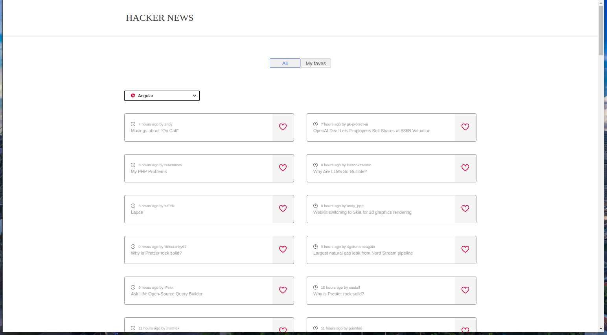
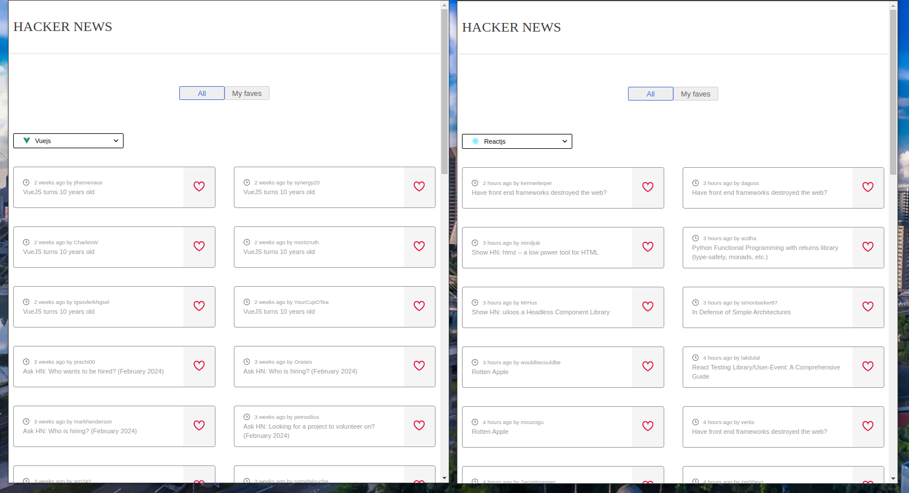
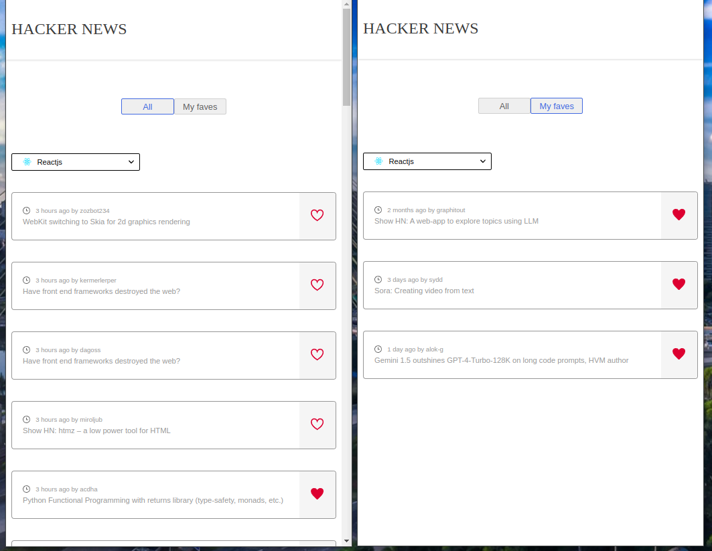

# Hacker News

Hacker News is a web application built using React and TypeScript, powered by the [Hacker News API](https://hn.algolia.com/api/v1/search_by_date?query=reactjs&page=1). It offers users two main sections: one for browsing stories across different programming languages, and another to view bookmarked stories. Each story includes a link to read the full article.

## Features

- **Story Sections**: Explore stories categorized by different programming languages.
- **Bookmarked Stories**: Keep track of your favorite stories by bookmarking them.
- **Local Storage**: Your bookmarked stories are saved locally using browser storage.
- **Responsive Design**: The application is designed to adapt to various screen sizes and devices.
<!-- ## Responsive Design -->

#### Desktop



#### Tablet



#### Mobile



- **Unit Testing**: Utilizes Jest for unit tests to ensure code reliability.
- **End-to-End Testing**: Cypress is used for end-to-end testing to simulate user interactions and ensure application functionality.

## How to run

To get started, clone the repository and install dependencies:

1. Clone this repository.

```bash
git clone https://github.com/Lachicagladiadora/hacker-news.git
cd hacker-news
code hacker-news
```

2. Run `npm install` to install the dependencies.
3. Run `npm run dev` to run the server so you can enjoy the viewing.

## Testing

To run unit tests:

```bash
# For unit test
npm run test

# For e2e test
npm run cypres:open
```
